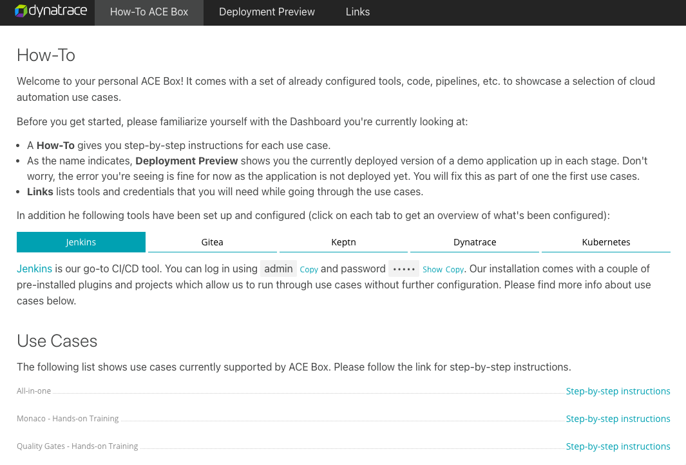

# ACE Dashboard

After spinning up the ACE-BOX, a URL gets printed out with a link to the ACE Dashboard

```
Outputs:

acebox_dashboard = "http://dashboard.xxx.xxx.xxx.xxx.nip.io using dynatrace:dynatrace to log in"
acebox_ip = "connect using ssh -i [location of key file] ace@xxx.xxx.xxx.xxx"
comment = "More information about dashboard credentials is printed out as part of the last provisioning step. Please scroll up."
```

If you hadn't changed the password for the dashboard, log in using `dynatrace` for both username and password.



## Layout

The dashboard has a few sections at the top:

- How-To ACE BOX: A landing page with links and description of all the components as well as links to the use cases
- Deployment Preview: shows the standard demo scenario's SimpleNodeService and how it is deployed accross the staging and production namespaces. It is normal that before running the pipelines this shows a 404 error
- Links: shows all the deployed components and credentials for connecting to them

## Building ACE Dashboard
The ACE Box Dashboard is built in React. In order to run it locally for development purposes a `$ npm install` and `$ npm run start` is required in `microk8s/docker/dashboard/`. This however will create artifacts that a) shouldn't be pushed to Git and b) seem to cause issues when provisioning the ACE Box. Therefore, please don't commit the `node_modules` folder and make sure to delete it locally before launching an ACE Box.