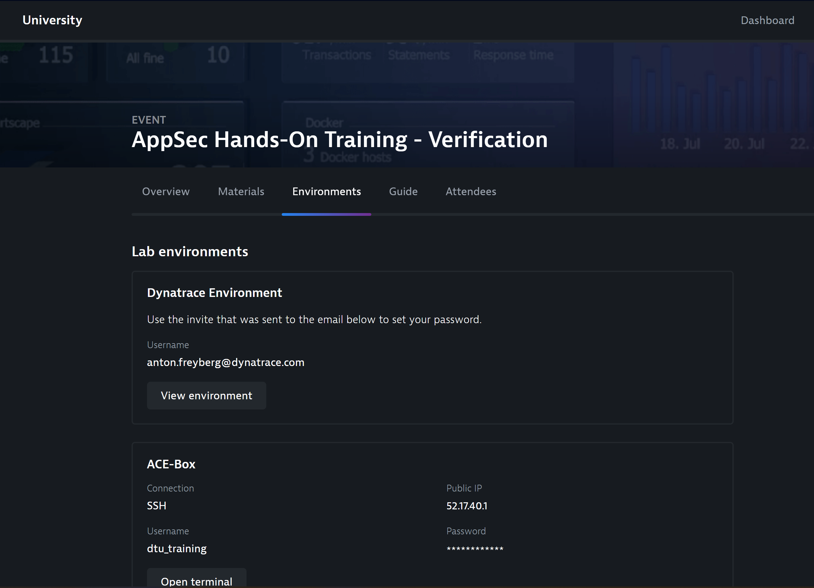

## Enable App Sec
### Verify access to environment
In Dynatrace University you will find the information on how to access the Environment required for the lab. Please make sure you can:
- Access the Dynatrace Environment using a web browser
- Connect to the bastion host using SSH

### Enable runtime vulnerability detection

To enable Application Security,  go to *Application Security > Vulnerabilities* and select Activate settings.

> Alternatively can also directly go to Settings > Application Security > Runtime vulnerability detection.

On the Runtime vulnerability detection page that opens, select *Enable runtime vulnerability detection*. 

> You also have the option to restrict it to certain technologies. 

### Enable OneAgent Features
After enabling runtime vulnerability detection, you need to enable OneAgent Java vulnerable function reporting. This is specifically just for vulnerable functions. The reporting of vulnerable components in general is generally available and running out of the box now.
- Under Settings > Service Side Service Monitoring > Deep Monitoring
- Scroll down to New OneAgent features and expand that section

Filter by *reporting* and enable the following features
- Java Vulnerable Function Reporting

