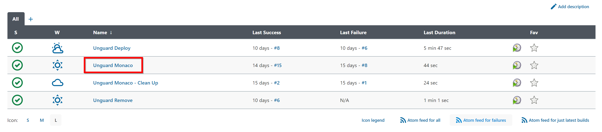
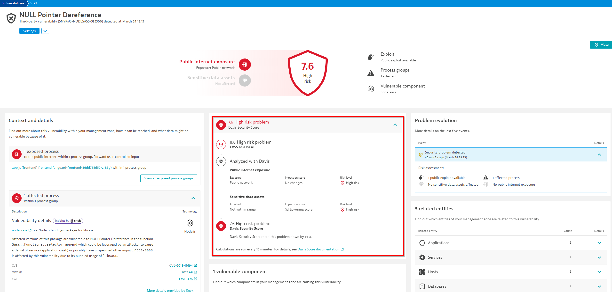

## Davis Security Score

In this hands on exercise we want to see how internet exposure affects the Davis Security Score in real time. 

### Run the Pipeline
Again, before taking a look of what happens behind the scenes, let's deploy the Dynatrace configuration. This time we want to deploy another project to our Dynatrace environment. Open the pipeline `Monitoring as Code`, go on `build with parameters`, enter `synthetic` in the project section and build the pipeline. 




While the pipeline runs, let us take a look at what we just deployed.


### Explore Configuration

#### Monaco 

Navigate in Gitea to `monaco/projects`. Under this folder you will find the three sub-projects that were deployed with the Jenkins pipeline just now. 

With these projects we deployed two synthetic tests. This is the folder struture of the project `synthetic`.


```groovy 

 ───monaco
    │   environments.yaml
    │       
    └───projects    
        ├───synthetic
        │   └───synthetic-monitor
        │           synthetic-monitors.yaml
        │           unguard-clickpath.json
        │           unguard-http.json 
```
### Jenkins Pipeline

The Jenkins pipeline is the same as the one from exercise 2. This time we deployed the `synthetic` project, instead of `base`.

```groovy
ENVS_FILE = "monaco/environments.yaml"

pipeline {
    parameters {
        string(name: 'PROJECT', defaultValue: 'base', description: 'The name of the monaco project to deploy.', trim: true)
    }
    agent {
        label 'monaco-runner'
    }
    stages {
        stage('Dynatrace Unguard config - Validate') {
            steps {
                container('monaco') {
                    script{
                        sh "monaco -v -dry-run -e=$ENVS_FILE -p=$PROJECT monaco/projects"
                    }
                }
            }
        }
        stage('Dynatrace Unguard config - Deploy') {
            steps {
                container('monaco') {
                    script {
                        sh "monaco -v -e=$ENVS_FILE -p=$PROJECT monaco/projects"
                    }
                }
            }
        }
    }
}
```


### DSS Recap
Why did we deploy a synthetic test? We did it to show how the Davis Security Score works. So let's quickly recap what the DSS is.

Davis Security Score (DSS) is an enhanced risk-calculation score based on the industry-standard Common Vulnerability Scoring System (CVSS). Because Davis AI also considers parameters like public internet exposure and checks to see if and where sensitive data is affected, DSS is the most precise risk-assessment score available.
The OneAgent knows and reflects that in the Davis Security Score.

Let's go to the next chapter to take a hands on look at the DSS!


### Simulating Public Exposure

#### Analyze changes in Davis Security Score

The deployed synthetic test we deployed, started calling the unguard application. For a vulnerability to have internet exposure, the vulnerable entity has to be called by at least two different non private network. The calls made by the activegate simulate an endpoint in a non private network. So now we also want to simulate the second endpoint. Before we do so, lets take at the current state of our vulnerabilities.

Navigate to `Vulnerabilities` and filter for `Risk assessment: Public Internet Exposure`. As you see, no entities are publicly exposed.


Before we go on, search for the vulnerability with CVE ID: `CVE-2018-19827`, open the vulnerability and see how the DSS has been lowered due to missing internet exposure.



Now, to simulate internet exposure, open `http://unguard.[<your_VM__IP_adress>].nip.io/ui/` yourself and generate some traffic .
Once you have done that, navigate back to `Vulnerabilities` and filter for `Risk assessment: Public Internet Exposure`. 

You will now see the vulnerabilities that evolved to publicly exposed vulnerabilities due to the synthetic activegate as well as your traffic.


We can also check for our vulnerability with CVE ID: `CVE-2018-19827`. You will find that the DSS score increase.

.


