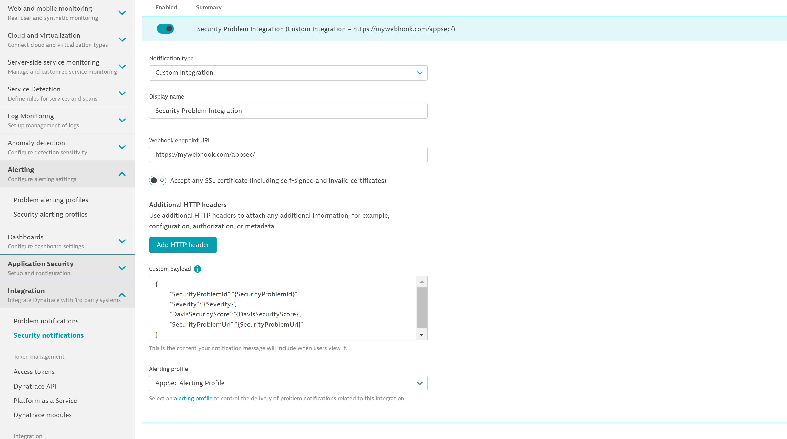

## Configure AppSec

### AppSec monitoring rules 
Security-monitoring rules allow you to set up fine-grained monitoring rules for processes, based on properties such as process tag, host tag, and management zone.

To configure the monitoring rules, go to you Dynatrace instance and navigate to `Settings` > `Application Security` > `Security monitoring rules`.
here you will be able to create rules that specifically define which entities you want to include/exlude from the AppSec monitoring. 

### Security alerting profiles and notifications

#### Alerting Profile

Security alerting profiles enable you to set up alert-filtering rules that are based on the risk level of detected security problems. This allows you to control which conditions result in security notifications and which don't.

To create a security alerting profile navigate to `Settings` > `Alerting` > `Security alerting profiles`. 

#### Notification

You can integrate Dynatrace security notifications with your organization's existing incident-management system or team-collaboration channel. Security alerting profiles are used within security integrations to filter the total number of alerts to a relevant subset.

To create a security alerting profile navigate to `Settings` > `Integration` > `Security notification`. 

